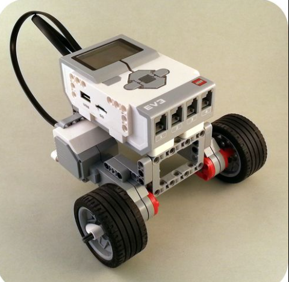
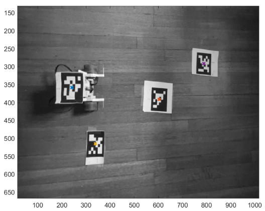
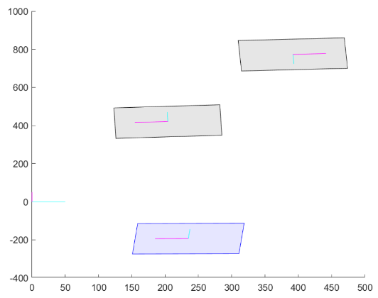
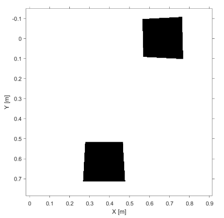
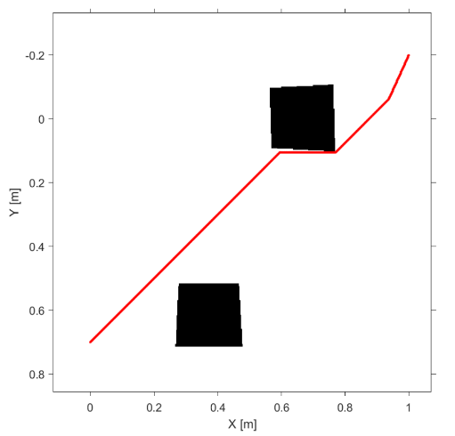

# Lego EV3 Obstacle Avoidance Rover | AER627 – Space Robotics
This project involved the design, programming, and demonstration of a LEGO EV3 two-wheel differential rover for autonomous obstacle avoidance. The rover navigates toward a goal while avoiding obstacles using a hybrid of Potential Field and A* path planning, with a Proportional-Derivative (PD) controller executing the motion along a sparsified path.

## Project Overview
- Autonomous two-wheel LEGO EV3 rover
- Obstacle avoidance using Potential Field and A* planners
- AprilTag-based scene recognition and mapping
- PD heading controller with MATLAB integration
- Real-world testing with calibration and friction challenges

## Contents
- [Project Report (PDF)](./627_project4_report.pdf) – Full write-up of design, theory, testing, tuning, and results
- [Demo Video (MP4)](./project4_demo.mp4) – Real-world demonstration of rover path execution and avoidance
- [MATLAB Code](./code_v3.m) – All source files including gradient planning, controller logic, and robot execution

## Rover

A simple design for the rover was used, featuring 2 wheels both connected to their own motors, along with a stabilizing
steel ball at the back providing structure and smoothing movement. An image of the design can be seen below.

  
*Rover Design*

## Apriltags and Scene Generation

Four Apriltags (barcode-like images) were used to generate a scene. A photo is taken of this scene, rendered and processed into the MATLAB program, and
a 2 rover paths are produced. One path using the generation of a potential field, the other using A* path planning. The purpose for each barcode is described below:  

apriltag 1: set the origin of the scene  
apriltag 2: set the location of the rover  
apriltag 3: obstacle 1  
apriltag 4: obstacle 2  

It is worth noting the start position is the initial position of the rover, while the end position (or end goal defining the end of the planned paths) is hard coded
once the scene has been rendered into the program. The following figures show the scene and its rendering after having been processed in MATLAB.  

  
*Scene Processed in MATLAB - photo taken using Iphone camera*

  
*Rendered Scene by MATLAB*

The purple shaded square is the rover, while the grey shaded squares are the obstacles.

## Occupancy Map

Once the Scene was taken, processed, and rendered, an occupancy map was generated. Its purpose is to model free and occupied space so that the rover (or algorithms) can plan paths, 
avoid obstacles, and localize themselves.

  
*Occupancy Map*

## A* Path

Once a suitable 2D grid map environment was generated via the occupancy map, the path planning was made possible for the scene.  
A* in MATLAB is a grid-based shortest-path search that finds a collision-free route across an occupancy map. For the scene that we generated, the A* path can be seen below.

  
*A-Star Path*

As you can see the red path almost touches the occupied grids in order to achieve the shortest path from the initial position of the rover to the end position.  
Which was hard-coded within the function.

## Potential Field and Potential Field Path

## Sparsified Path

## Authors
- Elliott Arpino  
- Octavio Guerra  

## Course Info
- AER627 – Introduction to Space Robotics, Winter 2025  
- Instructor: Dr. Anton de Ruiter  
- Toronto Metropolitan University
